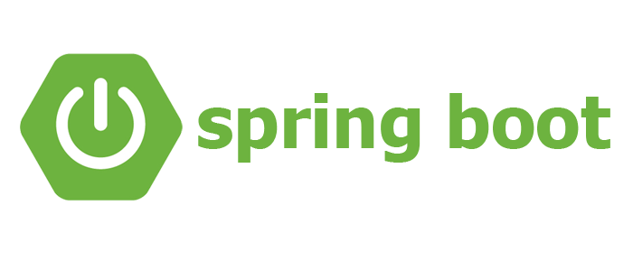

# spring

생성일: 2022년 7월 18일 오후 2:37

* 이전에는 EJB를 사용함
* 당시에 엔티티빈이라는 JPA같은 ORM기술을 가지고 있었음 - 근데 수천만원으로 비쌌다고함
* 어렵고 복잡하고 느림 - 이론만 좋음
* 2사람이 오픈소스로 스프링을 만들고 하이버네이트를 만듬 EJB를 비판함
* EJB는 망했다는걸 인정하고 하이버네이트를 만든사람을 데려와서 JPA 표준 인터페이스를 만듬
* 실무개발자들이 오픈소스로 만든걸 정제해서 JPA표준이 나오니 안정감 있음
* 스프링과 JPA가 가장 큰 메인기술이다.
* 3만 라인에 스프링의 모든걸 담음.. 로드존스.. 그리고 유겐휠러가 스프링의 제일 중요한 부분을 지금도 개발하고 있다함
* 이 강의의 시작은 처음으로 간다 왜 로드존스가 이런걸 개발했을까? 같은 질문애 답하기 위해 ㅎ
* 옛날에 주로 xml로 설정함 2000년 초반, 점점 편의기능지원하고 스프링 3.0부터 자바코드로 설정가능해짐
* 2014년에 스프링 부트가 나옴, 스프링 설정이 너무 어렵고 웹서버에 빌드하고 배포하는게 세팅하는게 복잡해서 이미 다른 오픈소스에서 서버 내장해서 설정 편하게 하는게 유행하고 있었는데 스프링이 그걸 받아들여서 스프링 부트가 나옴
* 옛날에는 스프링개발은 설정이 절반이라는 농담도 있었음 → 설정 힘들긴 함 ㅋㅋ

***

***

<figure><figcaption></figcaption></figure>

스프링이란?

* 스프링 데이터는 JPA같이 데이터를 다루기 쉽게
* 스프링 세션은 세션을 다루기 쉽게
* 스프링 시큐리티는 보안관련
* 스프링 Rest Docs는 API문서화를 편리하게
* 스프링 배치는 당연 배치를 위해

스프링의 진짜 핵심은

* 자바언어 기반의 프레임워크이기 때문에 자바언어의 가장 큰 특징인 객체지향으로 애플리케이션을 개발할 수 있다는것
* 스프링은 객체지향 언어가 가진 강력한 특징을 살림

객체지향은 추상화 캡슐화 상속 다형성 등의 특징이 있다

그중 다형성이 핵심인데 다형성을 이용해 프로그램을 유연하고 변경이 용이하게 만들수있다

* 역할과 구현
* 실세계에 비유 : 로비오와 줄리엣의 역할 / 그 역할을 구현하는 배우들
* 배우들은 누가되건 변해도 로미오와 줄리엣의 역할은 전혀 변하지않음
* 역할 = 인터페이스 , 구현 = 인터페이스를 구현한 클래스, 객체
* 객체를 설계할때 역할과 구현을 분리해 역할을 먼저 부여하고, 그 역할을 수행하는 구현 객체를 만듬
* 클라이언트 서버
* 클라이언트는 요청 서버는 응답, 둘은 협력관계를 가진다
* MemberService (클라이언트) 가 요청(save()실행)을 보내면 MemberRepository (인터페이스)가 구현한 객체의 save()를 실행하게 하게 할 수 있음 인터페이스가 구현한 객체들은 여러개로 구현 할 수 있고, save를 오버라이딩하고 있어서 실행시점에 객체만 변경해주면 유연하게 작동함 이걸 다형성이라 한다
* 다형성의 본질을 이해하려면 협력이라는 객체사이 관계에서 시작해야함 중요한건 클라이언트를 변경하지 않고도 서버의 구현 기능을 유연하게 변경한다는것
*

솔리드

1. SRP 단일 책임 원칙
   1. 한 클래스는 하나의 책임만 가져야한다
   2. 중요한 기준은 변경임 변경이 있을때 파급효과가 적으면 잘 따른것
2. OCP 개방-폐쇄 원칙
   1. 소프트웨어 요소는 확장에는 열려있으나 변경에는 닫혀있어야함
   2. 다형성을 활용하자
   3. 인터페이스를 구현한 새로운 클래스를 하나 만들어 새로운 기능 구현

위의 예시 문제점

* MemberService의 MemberRepository구현 객체를 변경하려면 클라이언트 코드를 변경해야함, 분명 다형성을 사용했지만 OCP 원칙을 지킬 수 없다.
* 이 문제를 해결하려면 객체를 생성하고 연관관계를 맺어주는 별도의 조립, 설정자가 필요함 → 스프링 컨테이너가 해줌

1. LSP 리스코프 치환 원칙
   1. 다형성에서 하위 클래스는 인터페이스 규약을 다 지켜야 한다
2. ISP 인터페이스 분리 원칙
   1. 특정 클라이언트를 위한 인터페이스 여러개가 범용 인터페이스 하나보다 나음
   2. 인터페이스가 명확해짐, 대체 가능성이 높아짐 → 덩어리가 작으면 좋다
3. DIP 의존관계 역전 원칙
   1. 프로그래머는 추상화에 의존해야지 구체화에 의존하면 안된다.
   2. 인터페이스에 의존해야지 구현 클래스에 의존하지 말라는뜻
   3.

### 다형성 만으로는 OCP, DIP를 지킬수 없음

클라이언트 코드가 변경되는걸 어떻게 할 수 없을까?? 모든 사람이 고민했음
