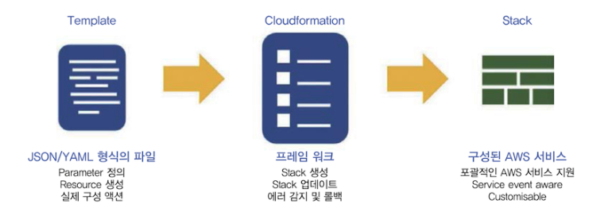

# SAM 개념

상태: Done
생성일: 2023년 1월 9일 오후 3:11
유형: 개념

AWS SAM(Serverless Application Model)은 AWS 환경에서 서버리스 애플리케이션을 구축할 때 사용할 수 있도록 AWS가 공식으로 제공하는 프레임워크이다.

SAM은 AWS CloudFormation이 확장된 형태로, 배포 과정에서 SAM Template이 CloudFormation Template으로 변환된다.

SAM을 통해 구축할 수 있는 AWS 서비스의 종류는 다음과 같다.

- API Gateway
- DynamoDB
- Lambda Function/Layer/Application

```jsx
AWSTemplateFormatVersion: '2010-09-09'
Transform: AWS::Serverless-2016-10-31
Description: >
  s3lambda

  Sample SAM Template for s3lambda
  
# More info about Globals: https://github.com/awslabs/serverless-application-model/blob/master/docs/globals.rst
Globals:
  Function:
    Timeout: 3
    MemorySize: 128

Resources:
  HelloWorldFunction:
    Type: AWS::Serverless::Function # More info about Function Resource: https://github.com/awslabs/serverless-application-model/blob/master/versions/2016-10-31.md#awsserverlessfunction
    Properties:
      CodeUri: hello-world/
      Handler: app.lambdaHandler
      Runtime: nodejs16.x
      Architectures:
        - arm64
      Events:
        HelloWorld:
          Type: Api # More info about API Event Source: https://github.com/awslabs/serverless-application-model/blob/master/versions/2016-10-31.md#api
          Properties:
            Path: /hello
            Method: get

Outputs:
  # ServerlessRestApi is an implicit API created out of Events key under Serverless::Function
  # Find out more about other implicit resources you can reference within SAM
  # https://github.com/awslabs/serverless-application-model/blob/master/docs/internals/generated_resources.rst#api
  HelloWorldApi:
    Description: "API Gateway endpoint URL for Prod stage for Hello World function"
    Value: !Sub "https://${ServerlessRestApi}.execute-api.${AWS::Region}.amazonaws.com/Prod/hello/"
  HelloWorldFunction:
    Description: "Hello World Lambda Function ARN"
    Value: !GetAtt HelloWorldFunction.Arn
  HelloWorldFunctionIamRole:
    Description: "Implicit IAM Role created for Hello World function"
    Value: !GetAtt HelloWorldFunctionRole.Arn
```

- **Transform 선언:** SAM Template임을 명시해야 함.
- **Globals 섹션:** 서버리스 애플리케이션에 공통적으로 적용되는 속성을 정의함.
- **Resources 섹션:** CloudFormation 리소스와 SAM 리소스를 정의함.

### 문제

- CloudFormation 코드에 익숙하지 않다면 러닝 커브가 있을 수 있음

### 그렇다면 CloudFormation는 무엇인가?

[[AWS] AWS CloudFormation 의 개념](https://nearhome.tistory.com/117)



aws 리소스와 속성이 정의된 템플릿을 생성하여

스택을 생성하고 템플릿에 설명된 리소스를 프로비저닝

프로비저닝 : 사용자의 요구에 맞게 시스템 자원을 할당, 배치, 배포해 두었다가 필요 시 시스템을 즉시 사용할 수 있는 상태로 미리 준비해 두는 것

스택 : 하나의 단위로 관리할 수 있는 AWS 리소스 모음

```jsx
# JSON

{
"AWSTemplateFormatVersion" : "version date",
# 템플릿 버전 

"Description" : "JSON string",
# 템플릿 설명

"Metadata" : { template metadata },
# 템플릿에 대한 추가 정보

"Parameters" : { Set of parameters },
# 템플릿 실행 시 전달한 파라미터 값

"Mappings" : { Set of mappings },
# 간소화된 표현을 위한 키,값 

"Conditions" : { Set of conditions },
# 특정 자원에 대한 생성 여부를 판단하는 조건

"Transform" : { Set of transforms },
# Serverless 애플리케이션용

"Resources" : { Set of resources },
# 생성될 AWS 리소스 나열 (필수항목)

"Outputs" : { Set of outputs }
# 템플릿 실행 후 만들어진 리소스 결과값 (자원 ID, IP 등)
}
```

참고

[AWS SAM이란](https://sarc.io/index.php/aws/2032-aws-sam)