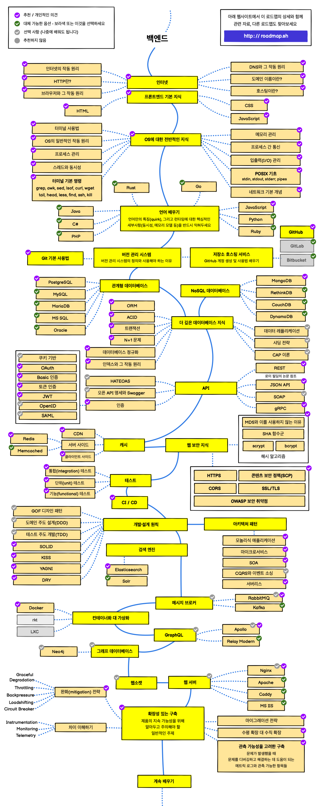

# 메인페이지

## 백엔드 로드맵

* 로드맵을 참고하여 백엔드 개발에 관한 학습을 하고 기록한다
* 메인페이지에 전부 기록 후 어느정도 내용이 쌓이면 페이지를 분리한다
* 학습중 모르는 개념은 주황 형광표시하고 일단 넘어간뒤 필요할때 학습하고 기록한다
* 학습한 강의나 영상, 글의 출처를 전부 기록한다
* 로드맵 관련 CC. [https://zero-base.co.kr/event/media\_BE\_school\_roadmap](https://zero-base.co.kr/event/media\_BE\_school\_roadmap)

<figure><figcaption></figcaption></figure>

### 인터넷

* 인터넷의 작동원리
* HTTP란
* 브라우저와 그 작동원리
* DNS와 그 작동원리
* 도메인 이름이란
* 호스팅이란

***

### AWS

#### VPC 와 Subnet

<figure><figcaption></figcaption></figure>

* VPC 란
  * AWS 서비스는 외부에서 퍼블릭으로 접근이 가능하지만 VPC는 접근이 불가하다.
  * VPC가 AWS 서비스에 접근하려면 인터넷 게이트웨이를 통해 접근해야한다. AWS 클라우드 내부이지만 직접 접근하지 못한다.
  * VPC 는 외부와 격리된 네트워크를 만드는게 목적. Virtual Private Cloud 의 약자. AWS 계정 전용 가상 네트워크이다.  EC2 , RDS , Lambda 등의 AWS 컴퓨팅 서비스 실행시 사용.
* VPC의 구성요소&#x20;
  * 서브넷, 인터넷 게이트웨이, NACL/보안그룹, 라우트테이블, NAT instance/NAT gateway, Bastion Host, VPC endpoint 등
* 서브넷
  * VPC의 하위단위로 VPC에 할당된 IP를 더 작은 단위로 분할한 개념
  * 하나의 서브넷은 하나의 가용영역에 위치
  * <mark style="background-color:orange;">CIDR block range</mark> 로 IP 주소 지정

<figure><figcaption></figcaption></figure>

CC. [쉽게 설명하는 AWS 기초 강좌 16:VPC 와 Subnet](https://www.youtube.com/watch?v=WY2xoIClOFA\&t=660s)

***
