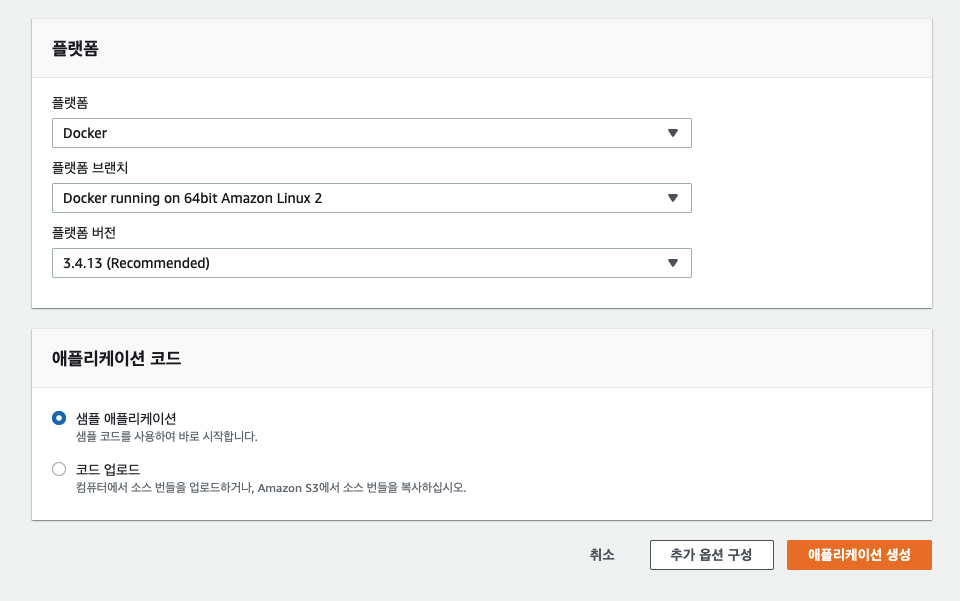

# Elastic Beanstalk + Elastic Cloud + docker 설정

### 단일 컨테이너 배포

* Dockerfile 의 이미지를 ECR 에 올리고 Dockerrun.aws.json 을 Beanstalk 에 배포하면 ECR의 이미지를 가져와 컨테이너로 실행하는 플로우
* ECR
  * 도커 허브의 레파지토리와 같은 기능을 함
  * IAM인증을 통해 간편하게 이미지를 push/pull할 권한관리를 해줌
  * 이후에 젠킨스를 적용할때도 잘 쓰임
  * [https://bluese05.tistory.com/51](https://bluese05.tistory.com/51)

1. beanstalk 환경 및 애플리케이션 생성

플랫폼을 도커로 설정

<figure><figcaption></figcaption></figure>

1. ECR 에서 레파지토리 생성 & IAM권한 주기

Amazon Elastic Container Registry (ECS) 에 리포지토리 생성, 이름만 설정해주면됨

그후에 “푸시명령보기”를 보면 cli로 이미지를 푸시할 수 있는 방법이 나와있음

AWS CLI 설정하고 IAM권한주고 이미지 올려주면됨

<figure><figcaption></figcaption></figure>

* Aws cli 다운 [https://devlos.tistory.com/37](https://devlos.tistory.com/37) (MAC기준)

```yaml
brew install awscli
```

```yaml
aws configure
//위명령어를 실행하면 Access Key, Secret Access Key 를 입력할수있음
```

*   IAM 권한

    * 사용자 권한 추가

    사용자에 ‘권한추가’로 들어가서 ‘기존정책직접연결’ 누르고 AmazonEC2ContainerRegistryFullAccess 연결해주면됨

    * Beanstalk 에 연결된 IAM 인스턴스 프로파일: aws-elasticbeanstalk-ec2-role 에도 권한추가해줘야함

    역할의 aws-elasticbeanstalk-ec2-role 에 AmazonEC2ContainerRegistryReadOnly로 권한 연결해주면됨

[https://binux.tistory.com/59](https://binux.tistory.com/59)

[https://devlog-wjdrbs96.tistory.com/324](https://devlog-wjdrbs96.tistory.com/324)

1. 배포

Dockerrun.aws.json 파일 작성후 이파일을 배포

```yaml
{
  "AWSEBDockerrunVersion": "1",
  "Image": {
    "Name": "ECR 이미지 URI"
  },
  "Ports": [
    {
      "ContainerPort": 3000
    }
  ]
}
```

[https://medium.com/devops-with-valentine/how-to-deploy-a-docker-container-to-aws-elastic-beanstalk-using-aws-cli-87ccef0d5189](https://medium.com/devops-with-valentine/how-to-deploy-a-docker-container-to-aws-elastic-beanstalk-using-aws-cli-87ccef0d5189)

### 다중 컨테이너 배포

* 다중 컨테이너로 구성하는 이유
  *   spring boot 와 filebeat는 각각 컨테이너로 관리해주고 volume으로 로그를 관리 해줘야 jar를 배포한 컨테이너가 죽어도 로그가 사라지지 않고 filebeat도 따로 컨테이너로 돌아가야 영향받지 않음

      [https://cloudinfrastructureservices.co.uk/dockerfile-vs-docker-compose-whats-the-difference/](https://cloudinfrastructureservices.co.uk/dockerfile-vs-docker-compose-whats-the-difference/)

      [https://medium.com/@lyzkevin2020/how-to-build-a-log-collection-system-for-springboot-projects-in-kubernetes-3f4c3e09dd6b](https://medium.com/@lyzkevin2020/how-to-build-a-log-collection-system-for-springboot-projects-in-kubernetes-3f4c3e09dd6b)
* volume 컨테이너로 로그관리
  * volume 컨테이너 생성하여 호스트os에도 저장, jar 와 filebeat 컨테이너 사이 로그폴더 공유가능함[https://joont92.github.io/docker/volume-container-추가하기/](https://joont92.github.io/docker/volume-container-%EC%B6%94%EA%B0%80%ED%95%98%EA%B8%B0/)

1. beanstalk 환경 및 애플리케이션 생성 (공통)
2. beanstalk 세팅 변경
   1.  프록시 서버 없음으로 설정, 환경속성 설정

       <figure><figcaption></figcaption></figure>
   2. 보안 키페어 설정
   3. ECR 에서 레파지토리 생성 & IAM권한 주기 (공통)
   4. docker-compose.yml 파일 생성, 이미지 업로드 및 배포

파일


#### filebeat

`Dockerfile`

```bash
FROM docker.elastic.co/beats/filebeat:8.5.0
COPY filebeat.yml /usr/share/filebeat/filebeat.yml
```

* 이미지 생성후 ECR에 업로드

`filebeat.yml`

```bash
filebeat.inputs:
- type: log
  enabled: true
  paths:
    - /logs/*.log

output.logstash:
  hosts: ["logstashIP:5044"]
```

* paths → filebeat컨테이너 내의 수집할 파일경로

#### olobo-server

`Dockerfile`

```bash
FROM amazoncorretto:17
COPY target/OLOBO-1.0-SNAPSHOT.jar olobo.jar
```

* jar파일 빌드 및 이미지 생성후 ECR에 업로드

`docker-compose.yml`

```bash
version: "3.9"
services:
  filebeat:
    image: ECR 이미지 URI
    volumes: 
      - app:/logs
  app:
    image: ECR 이미지 URI
    volumes: 
      - app:/logs
    ports:
      - "80:8080"
    environment:
      - AWS_ACCESS_KEY_ID=
      - AWS_SECRET_ACCESS_KEY=
      - AWS_DEFAULT_REGION=
      - AWS_REGION=
    depends_on:
      - filebeat
    restart: always
volumes:
  app:
```

\<aside> 💡 volumes의 경로가 중요함, 인스턴스 유형이 변경됨에 따라 app의 logs파일 경로가 /logs or /usr/local/logs 로 달랐음. 로그수집 안되면 eb ssh 로 직접 접속해서 volume 경로 확인하기

\</aside>

### logstash 배포

1. beanstalk 환경 및 애플리케이션 생성 (공통)
2. beanstalk 세팅 변경
   1. 프록시 서버 없음으로 설정
   2. 인스턴스 유형 t4g.medium으로 설정 (너무 낮으면 logstash 실행안됨)
3. ECR 에서 레파지토리 생성 (공통)
4. logstash 파이프라인 생성

* elatic cloud의 키바나에서 pipeline1으로 logstash 파이프라인을 생성

<figure><figcaption></figcaption></figure>

5. docker-compose.yml 파일 생성, 이미지 업로드 및 배포

파일


`logstash.yml`

```bash
xpack.management.enabled: true
xpack.management.pipeline.id: ["pipeline1"] # ID of your pipeline
xpack.management.elasticsearch.cloud_id: CLOUDID
xpack.management.elasticsearch.cloud_auth: ID:PW

# HTTP API Settings
http.enabled: true
http.host: 0.0.0.0
http.port: 9600
```

* elatic cloud의 키바나에서 pipeline1으로 logstash 파이프라인을 생성하고 연결

`Dockerfile`

```bash
FROM docker.elastic.co/logstash/logstash:8.5.0
RUN rm -f /usr/share/logstash/pipeline/logstash.conf
COPY config/logstash.yml /usr/share/logstash/config/logstash.yml
```

`docker-compose.yml`

```bash
version: "3.9"
services:
  logstash: 
    image: ECR 이미지 URI
    ports:
      - "9600:9600"
      - "5044:5044"
    restart: always
```
