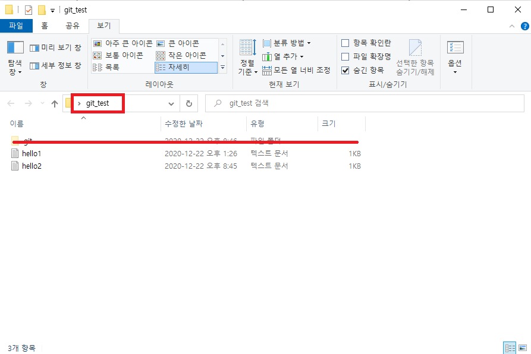

# 라이프사이클

### Git 의 3가지 영역

* Working Directory: 깃이 관리하도록 지정된 디렉토리임 (git 디렉토리 제외한 파일들)

<figure><figcaption></figcaption></figure>

* Staging Area: 인덱스라고 부르기도 하며(실제로 index 파일임) 커밋할 준비가 된 파일이 위치하는 (=add된 파일들) 영역임

<figure><figcaption></figcaption></figure>

* git directory : 커밋되어서 버전을 관리하는 파일들이 위치하는 영역임

<figure><figcaption></figcaption></figure>

### Git 의 3가지 상태

* Modified : 수정한 파일들 add나 commit은 아직 안한 상태
* Staged : 수정한 파일을 add 해서 커밋할 준비가 된 상태
* Commited : Staged 파일을 깃 디렉토리에 저장한 상태

### Git 의 라이프사이클

Working Directory 파일들은 크게 Tracked / Untracked 상태로 분류됨

Tracked 는 다음 Unmodified / Modified / Staged 상태로 분류됨

<figure><figcaption></figcaption></figure>

* Untracked : 워킹 디렉토리에 존재 하지만 깃이 관리하지 않는 파일
* Staged : 수정이 된 파일을 add 명령 했을시에 커밋 준비상태의 파일
* Unmodified : 수정 안한 파일 커밋하면 이리로 돌아옴
* Modified : 수정한 파일
