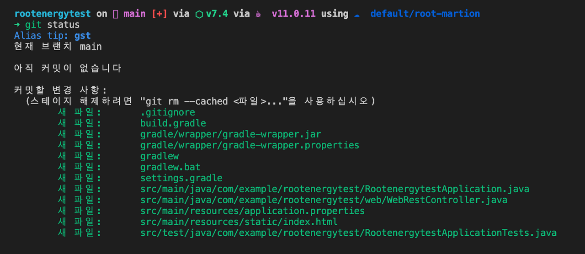

# git 원격저장소에 remote 방법(vscode로 진행)

* vscode로 spring boot 환경 설정이후 github에 git으로 업로드 진행하였습니다.
* 진행중 에러 상황 error: src refspec main does not match any 해결방법도 작성 했습니다.&#x20;

1\. git remote

먼저 코드를 올릴 github에 레파지토리를 생성합니다.

해당 URL을 복사하여 아래 명령을 실행합니다.

```
git remote add origin <URL>
```

origin 이라는 별칭을 붙여준 리모트 저장소를 워킹디렉토리에 추가해주는 작업 입니다.

&#x20;

```
git remote -v
```

위 명령을 실행하면 현재 추가된 리모트 저장소들을 확인 할 수 있습니다.

&#x20;

2\. 원격저장소에 소스코드 올리기

차례대로 add > commit > push 를 진행하는 중 에러가 발생했습니다.

push 진행중에 원격저장소에 올려지지 않고 에러가 발생했는데 아래와 같은 에러메시지가 보입니다.

error: src refspec main does not match any

&#x20;

처음에 별 생각없이 github에서 레파지토리를 생성한뒤 나오는 페이지의 안내에따라

아래 명령어를 복사해 실행시킨 뒤부터 push 에서 같은 에러가 떴습니다.

```
git remote add origin <URL>
git branch -M main
git push -u origin main
```

근데 해보고나니 git branch -M main 이 왜 있나 싶어요.

main은 이미 기본 브런치일텐데, 그리고 commit도 없이 바로 push?

&#x20;

아무튼 그래서 저는

```
git init
git commit -m "commit"
git push -u origin main
```

이렇게 해주었습니다.

init 으로 초기화 해줘서 된건가? 라고 생각했지만

다시 제 로그들을 보니 add 까지만 되고 commit 이 잘 되지 않았던것같다는 생각이 듭니다.

push하기 전에 git status 로 commit 되었는지 확인하고 push 했으면 이런일이 없었겠죠?

&#x20;

아래 에러메시지에 대한 답변을 보고 내가 commit이 제대로 안되었나보다.

알수있었습니다... 근데 국내 블로그글들은 pull없이 push할경우 기존내용을 삭제할 수 있어서 라거나&#x20;

명령어를 치는 과정중에 꼬여서? 그렇다고 하던데 그 말들도 맞는지는 확인을 안해봐서 모르겠습니다.

&#x20;

You need to add a file to a commit before you can push your changes to a remote Git repository. If you create a new repository and forget to add a file to a commit, you may encounter the “src refspec master does not match any” error.2020. 9. 21.

<figure><figcaption></figcaption></figure>
