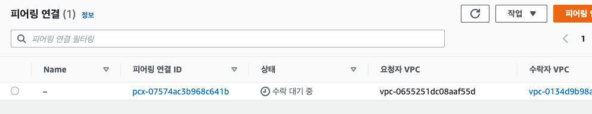

# MongoDB & Lambda VPC peering ,endpoint설정

상태: Done 생성일: 2023년 1월 12일 오후 5:06 유형: 세팅

> **S3에 파일업로드시 lambda가 실행되어 MongoDB의 데이터를 변경하는 작업을 위해 세팅해주어야 하는 요소들이 있다.** MongoDB Atlas와는 Peering으로 VPC를 연결해 주어야하고 람다를 VPC내부 private subnet 에 생성해주어야한다. 그리고 S3는 private subne에 접근하지 못하기 때문에 VPC endpoint 설정을 해주어야 정상적으로 작동한다.

## VPC peering

1. 대시보드에서 vpc 생성 ( VPC Wizard )

[Workshop - AWS Core Services](https://aws-core-services.ws.kabits.com/two-tier-application-linux/vpc/create-vpc/)


1. 아래와 같이 지정 후 생성


1. vpc와 연결된 보안그룹이 없으면 생성해줌

* 기존에 있는 VPC를 사용한다면 새로 생성해줄 필요없음


1. mongoDB peering Connection

위에서 설정한 aws의 적절한 정보를 작성해줌


1. 아래와 같이 피어링 된 목록이 뜨고, 안내된 내용대로 피어링을 진행하면 됨

Now all you have to do is accept the peering connection in your AWS account and update your route tables to send traffic for the Atlas VPC CIDR block to the peering ID.

→ 이제 AWS 계정에서 피어링 연결을 수락하고 라우팅 테이블을 업데이트하여 Atlas VPC CIDR 블록에 대한 트래픽을 피어링 ID로 전송하기만 하면 됩니다.


1. AWS 의 피어링 연결 목록에서 피어링 요청 수락



1. 라우팅 테이블에서 Atlas VPC CIDR 블록에 대한 트래픽을 피어링 ID로 전송하도록 세팅


라우팅 테이블 : 같은 VPC 내에서 서브넷A → 서브넷B를 연결할때 나침반처럼, 172.31.0.0 \~ 172.31.255.255 의 요청은 local로 같은 VPC내 로컬에서 찾도록 해주고, 그외 모든 IP대역은 인터넷 게이트웨이와 라우팅되어 인터넷과 연결된다.

현재 192.168.248.0/21(Atlas VPC CIDR)를 추가하여 이 IP대역으로 요청을 보낼땐 피어링연결이 된 MongoDB Atlas쪽 VPC로 라우팅 되도록 세팅해준것


## Lambda VPC 세팅

MonboDB와 피어링된 VPC내의 **private subnet을** 2개 생성, **보안그룹**도 하나 생성해준다.

template.yaml에 VpcConfig 세팅하면 배포시 자동으로 VPC가 설정된다.

```jsx
Resources:
  HelloWorldFunction:
    Type: AWS::Serverless::Function
    Properties:
      .....
			VpcConfig:
			  SecurityGroupIds:
			   - sg-***
			  SubnetIds:
			   - subnet-***
			   - subnet-***
```

* 람다를 vpc에 생성할때 private subnet을 써야하는 이유? 아직 모르겠음

그리고 VPC에 **엔드포인트**를 설정해야한다.

* VPC 엔드포인트?
* AWS를 벗어나지 않고 VPC의 외부서비스(=AWS서비스)와 프라이빗하게 연결하기 위해 사용한다. 이경우 퍼블릭으로 해당 서비스를 노출하지 않더라도 연동 할 수 있다.


[VPC에서 Lambda 함수에 인터넷 액세스 권한 부여](https://aws.amazon.com/ko/premiumsupport/knowledge-center/internet-access-lambda-function/)

[Access AWS S3 from Lambda within VPC](https://stackoverflow.com/questions/39779962/access-aws-s3-from-lambda-within-vpc)
