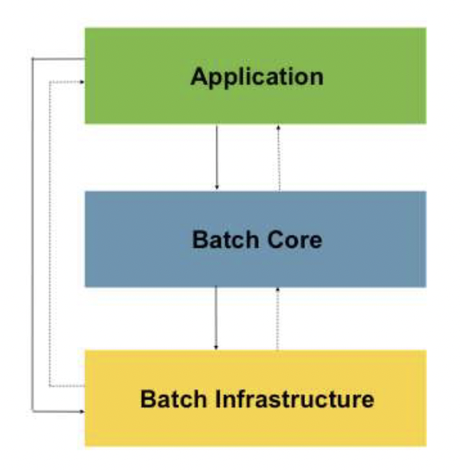

# Spring Batch 기본개념

## 스프링 배치의 핵심 패턴
- Read : 데이터베이스 , 파일 , 큐에서 다량의 데이터 조회한다
- Process : 특정 방법으로 데이터를 가공한다
- Write : 데이터를 수정된 양식으로 다시 저장한다

데이터를 조회하여 가공하고 저장하는 일련의 과정을 수행한다.
(자바기반의 배치 아키텍처 표준에 관한 필요성이 대두되어 만들어지게 되었다.)

Spring batch는..
배치 프로세스를 주기적으로 커밋하며, 병렬적으로 Job을 배치 처리하고 실패하면 재시작하며 Job안의 Step 여러개를 순차적으로 처리한다. 체계적이고 유연하다.

## 아키텍처

