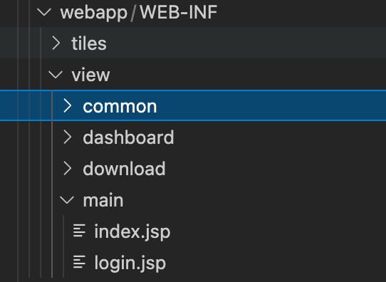
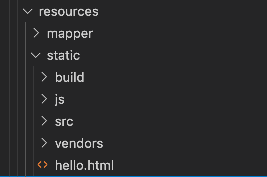
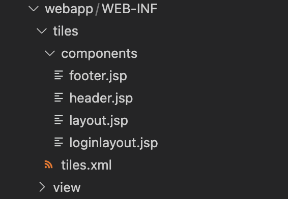

# [VSCODE setting] Spring boot + JSP(+Tiles) + MyBatis

생성일: 2022년 9월 2일 오후 10:19

### VSCODE setting

- 스프링부트는 JSP 를 권장하지 않음
- JSP를 사용하게 되면 WAR로 패키징 해야함, Tiles같은 라이브러리가 WAR에서만 정상작동 (직접확인함)
- 또한 JAR로 패키징할때 JSP로딩에 문제가 있고 제약이 있다고함
- 본인은 jsp라이브러리를 설치후 jar로 실행했을때 로딩은 잘 되었었으나 tiles 때문에 war로 패키징함

Refer

[https://hye0-log.tistory.com/28](https://hye0-log.tistory.com/28)

### build.gradle

```
plugins {
	id 'org.springframework.boot' version '2.7.3'
	id 'io.spring.dependency-management' version '1.0.13.RELEASE'
	id 'java'
	id 'war'
}

group = 'com.rootenergy'
version = '0.0.1-SNAPSHOT'
sourceCompatibility = '8'

configurations {
	compileOnly {
		extendsFrom annotationProcessor
	}
}

repositories {
	mavenCentral()
}

dependencies {
	implementation 'org.springframework.boot:spring-boot-starter-web'
	implementation 'org.mybatis.spring.boot:mybatis-spring-boot-starter:2.2.0'
	implementation 'com.google.code.gson:gson:2.8.0'
	implementation 'org.apache.httpcomponents:httpclient:4.3.6'
	implementation 'com.sun.mail:javax.mail:1.6.1'
	compileOnly 'org.projectlombok:lombok'
	developmentOnly 'org.springframework.boot:spring-boot-devtools'
	runtimeOnly 'mysql:mysql-connector-java:8.0.28'
	annotationProcessor 'org.projectlombok:lombok'
	testImplementation 'org.springframework.boot:spring-boot-starter-test'
	testImplementation 'org.mybatis.spring.boot:mybatis-spring-boot-starter-test:2.2.2'
	implementation 'org.apache.poi:poi:3.7'
	implementation 'org.apache.poi:poi-ooxml:3.7'
	implementation 'javax.servlet:jstl'
  implementation "org.apache.tomcat.embed:tomcat-embed-jasper"
	implementation group: 'org.apache.tiles', name: 'tiles-jsp', version: '3.0.5'

}

tasks.named('test') {
	useJUnitPlatform()
}

war {
	archiveName('erp.war')
}
```

- jsp 사용을 위해 추가한 라이브러리들

```
//jsp
implementation 'javax.servlet:jstl'
implementation "org.apache.tomcat.embed:tomcat-embed-jasper"
//tiles
implementation group: 'org.apache.tiles', name: 'tiles-jsp', version: '3.0.5'
```

### application.yml

```
spring:
  mvc:
    static-path-pattern: /resources/**
    view:
      prefix: /WEB-INF/view/
      suffix: .jsp
  datasource:
        driver-class-name: com.mysql.cj.jdbc.Driver
        url: /*url*/
        username: /*username*/
        password: /*password*/

mybatis: 
    typeAliasesPackage: com.rootenergy.erp.entity
    mapper-locations: classpath:mapper/**/*.xml
```

- JSP 사용을 위한 파일 구조 webapp > WEB-INF > view



스프링부트에는 정적자원 접근을 위한 디폴트 설정이 있다

보면 스프링부트는 resources > static 에서 정적자원에 접근한다 (자동생성된폴더)

```java
public class ResourceProperties {
    private static final String[] CLASSPATH_RESOURCE_LOCATIONS = new String[]{"classpath:/META-INF/resources/", 
    "classpath:/resources/", "classpath:/static/", "classpath:/public/"};
출처: https://warpgate3.tistory.com/164 [무명소졸의 웹개발:티스토리]
```



static 파일 아래 hello.html 파일을 두고

[localhost:8080/hello.html](http://localhost:8080/hello.html) 을 호출하면 정상적으로 로드된다

- 별도의 설정을 통해 원하는 URI패턴을 정해줄수도 있다
    - static-path-pattern: /resources/** → /resources/hello.html 로 호출
- prefix , suffix 설정 (ModelAndView객체에서 선언된 View Page를 지정해주는 클래스의 프로퍼티임)

```
spring:
  mvc:
    static-path-pattern: /resources/** => 정적파일
    view:
      prefix: /WEB-INF/view/
      suffix: .jsp
```

### Tiles

[TilesConfig.java](http://TilesConfig.java)

```java
import org.springframework.context.annotation.Bean;
import org.springframework.context.annotation.Configuration;
import org.springframework.web.servlet.view.tiles3.TilesConfigurer;
import org.springframework.web.servlet.view.tiles3.TilesView;
import org.springframework.web.servlet.view.tiles3.TilesViewResolver;

@Configuration
public class TilesConfig {

    @Bean
	public TilesConfigurer tilesConfigurer() {
        final TilesConfigurer configurer = new TilesConfigurer();
        //해당 경로에 tiles.xml 파일을 넣음
        configurer.setDefinitions(new String[]{"/WEB-INF/tiles/tiles.xml"});
        configurer.setCheckRefresh(true);
        return configurer;
    }

    @Bean
    public TilesViewResolver tilesViewResolver() {
        final TilesViewResolver tilesViewResolver = new TilesViewResolver();
        tilesViewResolver.setViewClass(TilesView.class);
        return tilesViewResolver;
    }
    
}
```

- tiles 위치



tiles.xml

```java
<?xml version="1.0" encoding="UTF-8" ?>
<!DOCTYPE tiles-definitions PUBLIC
       "-//Apache Software Foundation//DTD Tiles Configuration 3.0//EN"
       "http://tiles.apache.org/dtds/tiles-config_3_0.dtd">
<tiles-definitions>
   <!-- 기본 레이아웃 -->
    <definition name="layout" template="/WEB-INF/tiles/components/layout.jsp">
        <put-attribute name="header" value="/WEB-INF/tiles/components/header.jsp" />
        <put-attribute name="content" value="" />
        <put-attribute name="footer" value="/WEB-INF/tiles/components/footer.jsp" />
    </definition>
    
    <definition name="layout/*/*" extends="layout">
        <put-attribute name="content" value="/WEB-INF/view/{1}/{2}.jsp" />
    </definition>

    <!-- 레이아웃 없음 -->
    <definition name="loginlayout" template="/WEB-INF/tiles/components/loginlayout.jsp">
        <put-attribute name="header" value="" />
        <put-attribute name="content" value="" />
        <put-attribute name="footer" value="" />
    </definition>
    
    <definition name="loginlayout/*/*" extends="loginlayout">
        <put-attribute name="content" value="/WEB-INF/view/{1}/{2}.jsp" />
    </definition>

</tiles-definitions>
```

layout.jsp

- tiles.xml 에서 명시한 위치의 header, content, footer를 해댱위치에 넣어줌

```java
<%@ page language="java" contentType="text/html; charset=UTF-8" pageEncoding="UTF-8"%>
<!DOCTYPE html>
<html lang="en">
<head>
</head>
<body>
		<!-- Main wrapper  -->
    <tiles:insertAttribute name="header" />
    <tiles:insertAttribute name="content" />
    <tiles:insertAttribute name="footer" />
</body>
</html>
```

Controller

- tiles.xml 에서 설정한 대로 layout/*/* → layout/main/index 이런식으로 URI를 호출해야함

```java
/**
     * 로그인,메인 페이지 이동
     */
    @RequestMapping(value="/", method=RequestMethod.GET)
    public ModelAndView main(Model model, HttpSession session) {
        String returnUrl = "";

        Member member = (Member) session.getAttribute("MEMBER");

        if(member != null && !Util.chkNull(member.getId())){
            returnUrl = "layout/main/index";
        }
        else{
            returnUrl = "loginlayout/main/login";
        }

        return new ModelAndView(returnUrl);
    }
```